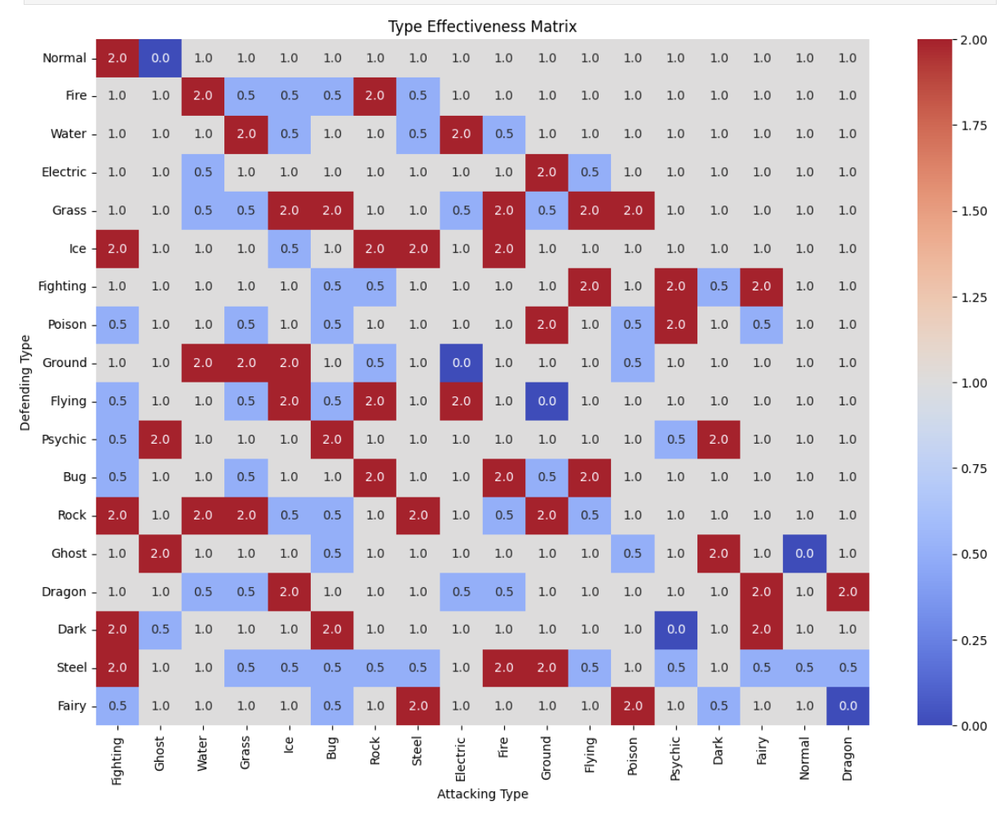
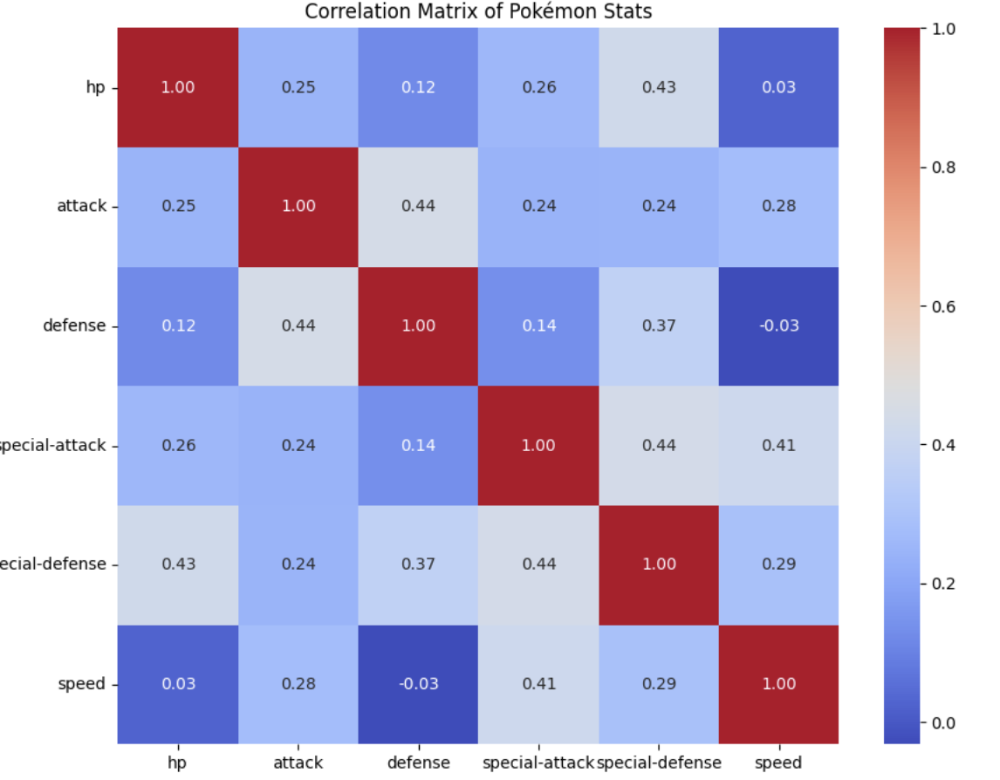
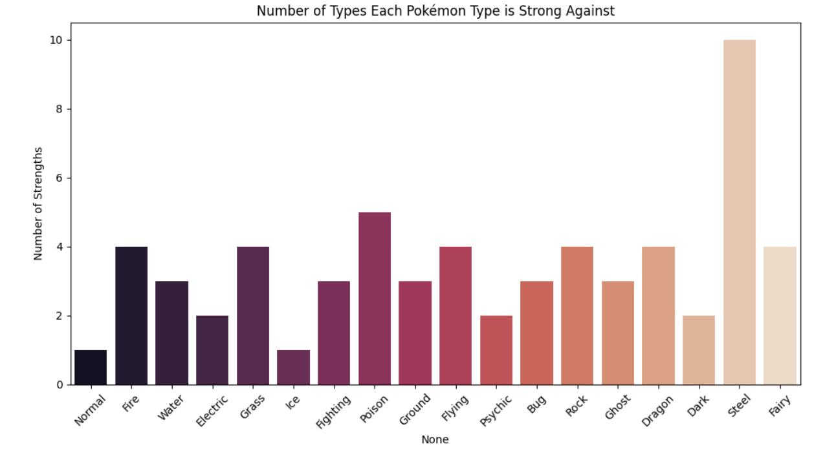
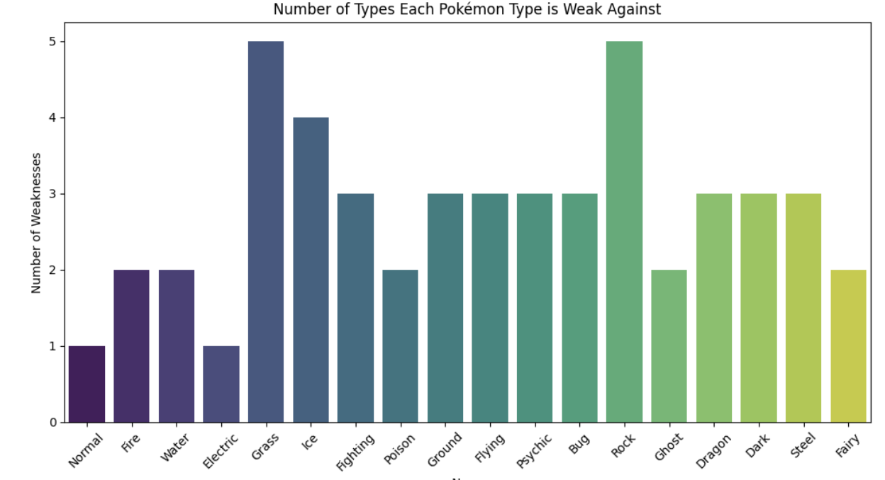
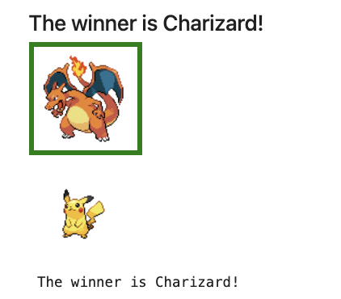

# Pokémon Battle Prediction System

This project implements a machine learning-based battle prediction system using Pokémon data from Generations 1 and 2. It predicts the winner between two Pokémon based on key attributes such as HP, Attack, Defense, and more.

---

## Dataset

- **Source**: Extracted from PokeAPI
- **Generations**: 1 & 2
- **Total Entries**: 251 Pokémon
- **Features**: HP, Attack, Defense, Special Attack, Special Defense, Speed, Type, Abilities, Weight, Base Experience

---

## Exploratory Data Analysis (EDA)

### Type Effectiveness Matrix

A heatmap showing how effective each Pokémon type is when attacking another type.

### Stat Correlation Heatmap

This matrix displays how different Pokémon stats correlate with each other.

### Strengths by Type

Number of other types each Pokémon type is strong against.

### Weaknesses by Type

Number of types each Pokémon type is weak to.

---

## Model Training and Evaluation

We trained three classification models to predict the winner of a Pokémon battle:

### 1. Random Forest Classifier
- **Accuracy**: 97.5%
- Best performing model.
- Handles complex interactions well.

### 2. Gradient Boosting Classifier
- **Accuracy**: 96.9%
- Robust model focusing on difficult-to-classify examples.

### 3. Decision Tree Classifier
- **Accuracy**: 93.6%
- Simple and interpretable but prone to overfitting.

---

## Interactive Prediction

The system allows users to input two Pokémon and predicts the winner using trained models.

---

## Limitations

- Does not currently account for move-based advantages or real-time battle mechanics.
- Predictive models are limited to stat-based features only.

---

## Future Work

- Integrate type effectiveness and move sets into prediction logic.
- Expand to include additional generations and mega-evolutions.
- Incorporate deep learning for improved battle simulation.
- Deploy as a real-time web application.

---

## Authors

**Aditya Sinha**  
M.S. in Data Science, Drexel University  
Email: as5869@drexel.edu
